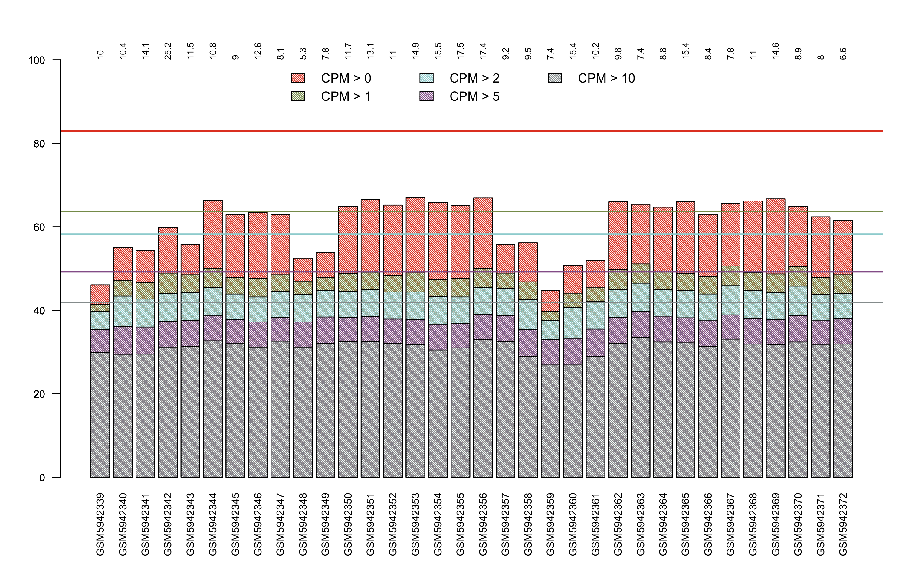

```{r setup, include=FALSE}
knitr::opts_chunk$set(echo = TRUE)
```
# Individual Exercises: Extending our first pipeline: review and add
This report contains the results of the extended analysis in the RNAseq data reported in Brauns et al, 2022 (https://insight.jci.org/articles/view/154183) using and modifying the code provided by Prof. Gomez-Cabrero during the second class on January 30, 2024. 

## 1. Reviewed the normalization and differential expression

### Experimental design
Lets review experimental design from a practical perspective

```{r read data}

# Read data from GEO
urld <- "https://www.ncbi.nlm.nih.gov/geo/download/?format=file&type=rnaseq_counts"
path <- paste(urld, "acc=GSE198256", "file=GSE198256_raw_counts_GRCh38.p13_NCBI.tsv.gz", sep="&");
GSE198256_count <- as.matrix(data.table::fread(path, header=T, colClasses="integer"), rownames=1)

# Read Meta data from GEO
library(GEOquery)
gds <- getGEO("GSE198256")
Meta_GSE198256 <- pData(gds$GSE198256_series_matrix.txt.gz@phenoData)
Group <- Meta_GSE198256[,c("disease state:ch1")]

#Check the size of our count matrix
dim(GSE198256_count)

#check the structure of our groups of comparison 
Group

```
### Limma: Normalize and set design

```{r Normalize and set design, echo=FALSE}

# set DGE class
require(limma)
require(edgeR)
dge <- DGEList(counts=GSE198256_count)

# Make sure on the metadata
rownames(Meta_GSE198256)==colnames(GSE198256_count)
Group[Group=="Covid19: Acute infection"] <- "Covid19AI"
Group[Group=="Covid19: Recovery 3Mo"] <- "Covid193Mo"
Group[Group=="Covid19: Recovery 6Mo"] <- "Covid196Mo"
design <- model.matrix(~ Group ) #we keep the intercept


# Filter
keep <- filterByExpr(dge, design=design)
dge <- dge[keep,,keep.lib.sizes=FALSE]

# Normalization, the default method is TMM 
dge <- calcNormFactors(dge)
```
### Limma Voom or Trend? 

After normalization we need to define which is the better transformation for our data. 
```{r Voom or Trend}

## Trend

# If the sequencing depth is reasonably consistent across the RNA samples, then the simplest and most robust approach to differential expression is to use limma-trend. This approach will usually work well if the ratio of the largest library size to the smallest is not more than about 3-fold.
logCPM <- cpm(dge, log=TRUE, prior.count=3)
 # The prior count is used here to damp down the variances of logarithms of low counts.
fit <- lmFit(logCPM, design)
fit <- eBayes(fit, trend=TRUE)
 # logical, should an intensity-dependent trend be allowed for the prior variance? If FALSE then the prior variance is constant. Alternatively, trend can be a row-wise numeric vector, which will be used as the covariate for the prior variance.
 # The use of eBayes or treat with trend=TRUE is known as the limma-trend method (Law et al, 2014; Phipson et al, 2016). With this option, an intensity-dependent trend is fitted to the prior variances s2.prior
topTable(fit, coef=ncol(design))


## Voom

# When the library sizes are quite variable between samples, then the voom approach is theoretically more powerful than limma-trend.
v <- voom(dge, design, plot=TRUE)
v
# The voom method is similar in purpose to the limma-trend method, which uses eBayes or treat with trend=TRUE. The voom method incorporates the mean-variance trend into the precision weights, whereas limma-trend incorporates the trend into the empirical Bayes moderation. The voom method takes into account the sequencing depths (library sizes) of the individual columns of counts and applies the mean-variance trend on an individual observation basis. limma-trend, on the other hand, assumes that the library sizes are not wildly different and applies the mean-variance trend on a genewise basis. As noted by Law et al (2014), voom should be more powerful than limma-trend if the library sizes are very different but, otherwise, the two methods should give similar results.
fitV <- lmFit(v, design)
fitV <- eBayes(fitV)
topTable(fitV, coef=ncol(design))
```
## ACTIVITY 1.1 :How would you compare the results between voom and trend?

To compare both methods, first I will plot the result of applying each transformation to the data. This is a good hint to verify weather the transformation did work or not. 
```{r plotting voom & trend}
#plotting voom
#ploting voom fit
plotSA(fitV, main="Final model: Voom transformation")
#plotting trend fit
plotSA(fit, main="Final model: Trend transformation")
```
The plots above were created using plotSA which plots log2 residual standard deviations against mean log-CPM values. In both plots, each black dot represents a gene and the average log2 residual standard deviation estimated by the empirical Bayes algorithm is marked by a horizontal blue line.From the graph we can also conclude that voom showed better fit than trend, since only with voom the trends are gone. This could be explain partially due to the fact that we have some library size discrepancies in the dataset, with some big libraries like GSM5942341 (14.1) and other almost three times smaller, like GSM5942348 (5.3)(see figure below, for more details please refer to noiseq analysis on report 1) then the power of voom outperformed trend. 
```{r, echo=FALSE}

```
Other way to explore the effect of Voom vs Trend is to check into the differentially express genes obtained with each method. 
```{r summary DEGs}
#DEGs Limma-trend
summary(decideTests(fit))
#DEGs Limma-Voom
summary(decideTests(fitV))        
```
We can observe that voom approach allowed the identification of similar number of degs.Now lets see how corelated are those DEGs based on their p-values.
```{r scatter plot p-values}
a <- lm(fitV$p.value~fit$p.value)
#do the plot
plot(fit$p.value, fitV$p.value, main="scatter plot of p-values", xlab="Limma-trend", ylab = "Limma-voom")
#add line
abline(a, col="red")
#Show statistics
summary(a)
```
From the previuos plot and statistics (specially $R^{2}adj$) we can observe a high level of correlation ($R^{2}adj > 0.8$) for all the contrast except the intercept term. **Conclusion**, voom fit performed slighly better than trend but we can trust the DEGs from both approaches since are representing the most relevant/strong differential expressed. 

## ACTIVITY 1.2: What exactly are we asking with this differential expression?  

With the current design: ($design <- model.matrix(~ Group )$) we are using a design matrix with an intercept term.If we see our design matrix we can observe that it has the same number of columns as the factor Group has levels.The design matrix contains a column of 1s (the intercept term), and a column with values as 0s or 1s (a value of 1 when the associated sample is in the group specified in the column (e.g. GroupCovid196Mo) and 0 otherwise).

| (Intercept)    | GroupCovid196Mo | GroupCovid19AI | GroupHealthy |
|----------------|-----------------|----------------|--------------|
| 1              | 0               | 0              | 1            |
| 1              | 0               | 0              | 1            |
| 1              | 0               | 0              | 1            |
| 1              | 0               | 0              | 1            |
| 1              | 0               | 0              | 1            |
| 1              | 0               | 0              | 1            |

This design matrix is parameterised for a mean-reference model, where the intercept term in the first column is parameterised for the mean expression of the Covid193Mo,the second column is parameterised for the mean expression of the Covid196Mo group relative to Covid193Mo, the third column is parameterised for the mean expression of the Covid19AI group relative to Covid193Mo and the fourth column is parameterised for the mean expression of the Healthy group relative to Covid193Mo. The Covid193Mo group is selected as the reference level since  is the first level in group when ordered alphanumerically. This is because, the levels in a factor are ordered alphanumerically by default. **Conclusion**, with the current design and levels distribution we are looking into gene expression differences between Covid196Mo/Covid19AI/Healthy against the Covid193Mo group. 

## ACTIVITY 1.3: Is it required to run more analysis?

Yes, with the current configuration of levels I can not see the contrast as I expect. For reproducibility I expect to produce the same contrasts as in the original publication.In the paper the authors mentioned they performed the DE analysis by comparing the different groups of COVID19 patients with the healthy controls.Since the reference level by default does not correspond with my real reference, I will do a re-specification of the reference level using the relevel function, to define the healthy status as the reference for the contrasts.  
```{r redo the design matrix}
#Convert Group in a factor and relevel to make Healthy our reference
Group2 <- relevel(factor(Group), ref = "Healthy")
#Create our new design matrix
design2 <- model.matrix(~ Group2)
design2
```
Now that we have our design matrix as desired lets calculate the differential expression for the expected contrasts.

```{r DEG analysis}

#fit to the new design
v2 <- voom(dge, design2, plot=TRUE)
v2
fitV2 <- lmFit(v2, design2)
fitV2 <- eBayes(fitV2)
plotSA(fitV2, main="Final model: Voom transformation")


#We can check all the degs directly 
summary(decideTests(fitV2))

# or one by one
topTable(fitV2) 
topTable(fitV2,coef=1) #Covid19AI-Healthy
topTable(fitV2,coef=2) #Covid193Mo-Healthy
topTable(fitV2,coef=3) #Covid196Mo-Healthy

```
Other option to check our degs is to look into specific contrasts, this would be specially useful if we want to make comparisons among groups other than the comparison against the healthy group for example to compare acute covid19 patients vs late recovery patients we shoud specify our contrast as: Group2Covid19AI - Group2Covid196Mo. For this experiment, since we are interested in comparisons against healthy individual and we already selected healthy as the reference for the contrast we just need to specify the non-reference group.
```{r DEG by contrast}

contrast.matrix <- makeContrasts(Group2Covid19AI, Group2Covid193Mo, 
                                 Group2Covid196Mo,    
                                 levels=design2)

fit3 <- contrasts.fit(fitV2, contrast.matrix)
fit3 <- eBayes(fit3)
topTable(fit3) 
topTable(fit3,coef=1) #Covid19AI-Healthy
topTable(fit3,coef=2) #Covid193Mo-Healthy
topTable(fit3,coef=3) #Covid196Mo-Healthy
```
Now if we check into the TopTable for each contrast obtained in the two previous chuncks we can see we got exactly the same results (the order varies a little but values are the same), so this are two ways of extract the information from our experiment. 
Now, going back to big numbers, if we look into the degs of our different contrasts summarized in the table below, we can observe that our trends correlate with the reported in the original manuscript at least for the contrast Late recovery vs Control (a.k.a  Group2Covid196Mo) where the authors observed a lack of DEGs.

|        | Intercept | Group2Covid193Mo | Group2Covid196Mo | Group2Covid19AI |
|--------|-----------|------------------|------------------|-----------------|
| Down   | 2274      | 588              | 0                | 661             |
| NotSig | 2586      | 15151            | 16409            | 14737           |
| Up     | 11549     | 670              | 0                | 1011            |

But if we want to properly estimate weather the number of degs are comparable or not with the original manuscript we need to filter our DEGs according to the significant thresholds used on the paper: FDR<0.5 and |FC| > 2.( Notice, A FC of 2 correspond to a log2fc = 1, since log2(2) = 1). The FDR threshold correspond to the default value on Limma, but for the LogFC we can apply The treat method (McCarthy and Smyth 2009) to calculate p-values from empirical Bayes moderated t-statistics with a minimum log-FC requirement.
```{r filtering DEGs}

tfit <- treat(fitV2, lfc=1)
dt <- decideTests(tfit)
summary(dt)
```
From the summary we can observe that after applying a LFC cuttoff of 1 we loss the majority of DEGs from our analysis. Then this result is not comparable to the one obtained by the original authors using DESeq2, where a high number of DEGs wrere detected in two of the three contrast. However, this behavior is in part expected, since literature reports a higher number of detected DEGs using DESeq2 in comparison to Limma (Tong, 2021). This highlights the importance of selecting the appropriate tools to interrogate our data to extract the most relevant and reliable information. 

## ACTIVITY 2.Plan the next Analysis

The goal of differential expression analysis is to determine which genes are expressed at different levels between conditions, in our case between COVID19 patients at different stages of recovery and healthy controls. These genes can offer biological insight into the processes affected by the conditions of interest.So, to gain biological insight into the differential expression results we need to perform functional analysis on the detected differential express genes (DEGs). For this aim, we should explore and collect databases of our interest.Since, to explore the biological context in which our DEGs are involved we need to know first which genes from the global genome are associated with each biological phenomenon. Among the most whidely used online databases for functional analysis are included:  
* Gene ontology: stores genes aassociated with particular biological processes, cellular components and molecular functions.
* Biological pathways: stores genes involved in particular biological pathways, among the most popular are KEGG and Reactome
* Others: there is almost one database for each biological question. for example, there are databases for genes associates to specific binding motifs, perturbation, epigenetic marks (e.g MSigDB), phenotypes (e.g Human phenotype ontology), and diseases (e.g OMIM)

In addition to the databases of our interest we need to define the techniques to use for the functional analysis. There are many approaches for this analysis we will focus in two methodologies: 

* Over-representation analysis: Compares the proportion of genes associated with a particular process/pathway in the list of differentially expressed genes to the proportion of genes associated with that pathway in a background list (genes tested for DE).Producing as a result processes/pathways related to genes exhibiting larger changes in expression between conditions (Piper,2023)

* GSEA: is a functional class scoring method. particularly helpful when there are few DEGs or when processes have genes exhibiting weaker buy coordinated expression changes.The GSEA method uses the log2 fold changes for all genes from the differential expression results to determine whether any biological pathways are enriched among the genes with positive or negative fold changes. (Piper,2023)

## ACTIVITY 3. Gene Set Analysis: ORA and GSEA

We start by preparing our data in the correct format for the ORA and GSEA analysis. First by converting our gene ids to the ENSEMBL format which is the required for the databases we are going to use for the functional annotation

```{r Prepare ORA and GSEA}

library(clusterProfiler)
library(msigdbr)
library(org.Hs.eg.db)
library(magrittr)

keytypes(org.Hs.eg.db)

# If we want to shift annotations:
ENSEMBL_vector <- mapIds(
  # Replace with annotation package for the organism relevant to your data
  org.Hs.eg.db,
  # The vector of gene identifiers we want to map
  keys = rownames(GSE198256_count),
  # Replace with the type of gene identifiers in your data
  keytype = "ENTREZID",
  # Replace with the type of gene identifiers you would like to map to
  column = "ENSEMBL",
  # In the case of 1:many mappings, return the
  # first one. This is default behavior!
  multiVals = "first"
)

# We would like a data frame we can join to the differential expression stats
gene_key_df <- data.frame(
  ensembl_id = ENSEMBL_vector,
  entrez_id = names(ENSEMBL_vector),
  stringsAsFactors = FALSE
) %>%
  # If an Ensembl gene identifier doesn't map to a gene symbol, drop that
  # from the data frame
  dplyr::filter(!is.na(ensembl_id))

```
Now, lets conduct ORA analysis

```{r Run ORA KEGG Covid19AI-Healthy }

# Step 1: determine genes of interest.since coef=1 we are looking at the contrast Covid19AI-Healthy
diff_table <- topTable(fit3,coef=1,p.value=0.01,number=10000) 
genes_dif<- rownames(diff_table)

# Step 2: determine background.

background_set <- unique(rownames(logCPM))

# Step 3: Determine gene sets (KEGG).

msigdbr_species()
hs_msigdb_df <- msigdbr(species = "Homo sapiens")
head(hs_msigdb_df)

hs_kegg_df <- hs_msigdb_df %>%
  dplyr::filter(
    gs_cat == "C2", # This is to filter only to the C2 curated gene sets
    gs_subcat == "CP:KEGG" # This is because we only want KEGG pathways
  )

# Step 4: conduct ORA.

kegg_ora_results_c1 <- enricher(
  gene = genes_dif, # A vector of your genes of interest
  pvalueCutoff = 0.1, # Can choose a FDR cutoff
  pAdjustMethod = "BH", # Method to be used for multiple testing correction
  universe = background_set, # A vector containing your background set genes
  # The pathway information should be a data frame with a term name or
  # identifier and the gene identifiers
  TERM2GENE = dplyr::select(
    hs_kegg_df,
    gs_name,
    human_entrez_gene
  )
)

# Step 5: Visualize / explore

enrich_plot_kegg_c1 <- enrichplot::dotplot(kegg_ora_results_c1)
enrich_plot_kegg_c1

upset_plot_kegg_c1 <- enrichplot::upsetplot(kegg_ora_results_c1)
upset_plot_kegg_c1

```

## ACTIVITY 3.1: alternatives to KEGG?  

KEGG database allow us to identify particular biological pathways in which our DEGs could be involved, in addition to the pathway functional annotation the other very popular database is Gene ontology (GO), So lets run ORA on GO to establish if our DEGs are associated with particular biological processes.

```{r ORA GO:BP Covid19AI-Healthy}
# Step 1:   I will keep the same as before. coef=1 we are looking at the contrast Covid19AI-Healthy
# Step 2: determine background. I will keep the same

# Step 3: Determine gene sets (GO).

msigdbr_species()
hs_msigdb_df <- msigdbr(species = "Homo sapiens")
head(hs_msigdb_df)

hs_go_df <- hs_msigdb_df %>%
  dplyr::filter(
    gs_cat == "C5", # This is to filter only to the C5 ontology gene sets (according to https://www.gsea-msigdb.org/gsea/msigdb/collections.jsp) 
    gs_subcat == "GO:BP" # This is because we want all the GO biological process terms, I can modify this parameter deppending on the GO   I want to analyze, for GO molecular function use GO:MF, for GO celular component use GO:CC
  )

# Step 4: conduct ORA.

gobp_ora_results_c1 <- enricher(
  gene = genes_dif, # A vector of your genes of interest
  pvalueCutoff = 0.1, # Can choose a FDR cutoff
  pAdjustMethod = "BH", # Method to be used for multiple testing correction
  universe = background_set, # A vector containing your background set genes
  # The pathway information should be a data frame with a term name or
  # identifier and the gene identifiers
  TERM2GENE = dplyr::select(
    hs_go_df,
    gs_name,
    human_entrez_gene
  )
)

# Step 5: Visualize / explore

enrich_plot_gobp_c1 <- enrichplot::dotplot(gobp_ora_results_c1)
enrich_plot_gobp_c1

upset_plot_gobp_c1 <- enrichplot::upsetplot(gobp_ora_results_c1)
upset_plot_gobp_c1
```
It is important also to remember that in our DEG analysis we interrogate three different contrasts of COVID19 samples at different recovery time vs healthy samples. So we can modify our set of genes of interest (defined in step 1 in the previous chuncks) to identify overrepresented pathways/GO in the different contrasts.Previously we used coef=1, meaning we performed our analysis using the DEGs from the contrast Covid19AI-Healthy. Now, lets change coef=2 to perform the ORA using DEGs from the contrast Covid193Mo-Healthy.
```{r ORA Covid193Mo-Healthy}

# Step 1: determine genes of interest.coef=2 we are looking at the contrast Covid193Mo-Healthy
diff_table2 <- topTable(fit3,coef=2,p.value=0.01,number=10000) 
genes_dif2<- rownames(diff_table2)

#step 2 as before
#Step 3 as before 

# Step 4: conduct ORA KEGG.

kegg_ora_results_c2 <- enricher(
  gene = genes_dif2, # A vector of your genes of interest
  pvalueCutoff = 0.1, # Can choose a FDR cutoff
  pAdjustMethod = "BH", # Method to be used for multiple testing correction
  universe = background_set, # A vector containing your background set genes
  # The pathway information should be a data frame with a term name or
  # identifier and the gene identifiers
  TERM2GENE = dplyr::select(
    hs_kegg_df,
    gs_name,
    human_entrez_gene
  )
)

# Step 4.1: conduct ORA GO:BP.

gobp_ora_results_c2 <- enricher(
  gene = genes_dif2, # A vector of your genes of interest
  pvalueCutoff = 0.1, # Can choose a FDR cutoff
  pAdjustMethod = "BH", # Method to be used for multiple testing correction
  universe = background_set, # A vector containing your background set genes
  # The pathway information should be a data frame with a term name or
  # identifier and the gene identifiers
  TERM2GENE = dplyr::select(
    hs_go_df,
    gs_name,
    human_entrez_gene
  )
)
# Step 5: Visualize / explore

enrich_plot_kegg_c2 <- enrichplot::dotplot(kegg_ora_results_c2)
enrich_plot_kegg_c2


#enrich_plot_gobp_c2 <- enrichplot::dotplot(gobp_ora_results_c2)
#enrich_plot_gobp_c2

#This analysis did not return any significant GO:BP therefore the plot will not work 
#Quitting from lines 350-396 [ORA Covid193Mo-Healthy] (GSE198256_Analysis_Class2.Rmd)
                                                                                                                           
#Error in `ans[ypos] <- rep(yes, length.out = len)[ypos]`:
#! replacement has length zero

```
We got only one enrich pathway in KEGG and none GO:BP significantly enriched in this contrasts, this could be due to our small input set of genes. let's see what happen if we try with all degs (p_value <0.05) not only those with p_value <0.01

```{r}

diff_table2 <- topTable(fit3,coef=2,p.value=0.05,number=10000) 
genes_dif2<- rownames(diff_table2)
# Step 4: conduct ORA KEGG.

kegg_ora_results_c2 <- enricher(
  gene = genes_dif2, # A vector of your genes of interest
  pvalueCutoff = 0.1, # Can choose a FDR cutoff
  pAdjustMethod = "BH", # Method to be used for multiple testing correction
  universe = background_set, # A vector containing your background set genes
  # The pathway information should be a data frame with a term name or
  # identifier and the gene identifiers
  TERM2GENE = dplyr::select(
    hs_kegg_df,
    gs_name,
    human_entrez_gene
  )
)

# Step 4.1: conduct ORA GO:BP.

gobp_ora_results_c2 <- enricher(
  gene = genes_dif2, # A vector of your genes of interest
  pvalueCutoff = 0.1, # Can choose a FDR cutoff
  pAdjustMethod = "BH", # Method to be used for multiple testing correction
  universe = background_set, # A vector containing your background set genes
  # The pathway information should be a data frame with a term name or
  # identifier and the gene identifiers
  TERM2GENE = dplyr::select(
    hs_go_df,
    gs_name,
    human_entrez_gene
  )
)
# Step 5: Visualize / explore

enrich_plot_kegg_c2 <- enrichplot::dotplot(kegg_ora_results_c2)
enrich_plot_kegg_c2

enrich_plot_gobp_c2 <- enrichplot::dotplot(gobp_ora_results_c2)
enrich_plot_gobp_c2
```
We increased the number of DEGs overrepresented in the KEGG pathway but our p.adj was reduced, and we got some GO:BP enriched in our set but still with a not super significant p_value. In this case,when a ORA is not sufficient to revel biological insights of our data, a good alternative would be to move on the GSEA analysis since is a method that does not depend on the DEGs but in the totality of expressed genes.

## Lets conduct GSEA
```{r run GSEA KEGG}

set.seed(101)

# Step 1: determine genes of interest (all genes expressed)
diff_table_all <- topTable(fit3,coef=1,p.value=1,number=nrow(logCPM)) 

# Step 2: determine background. We don't need a backgroup for GSEA 

# Step 3: Determine gene sets.

#msigdbr_species()
hs_msigdb_df <- msigdbr(species = "Homo sapiens")
#head(hs_msigdb_df, n=3)

hs_kegg_df <- hs_msigdb_df %>%
  dplyr::filter(
    gs_cat == "C2", # This is to filter only to the C2 curated gene sets
    gs_subcat == "CP:KEGG" # This is because we only want KEGG pathways
  )

# Step 4: conduct GSEA
# ordering by paramenter B (we can order by logFC, p-value or any metric we like)
list_ordered <- diff_table_all[,"B"]
names(list_ordered) <- rownames(diff_table_all)
  
  
gsea_results_kegg <- GSEA(
  geneList = list_ordered, # Ordered ranked gene list
  minGSSize = 25, # Minimum gene set size
  maxGSSize = 500, # Maximum gene set set
  pvalueCutoff = 0.05, # p-value cutoff
  eps = 0, # Boundary for calculating the p value
  seed = TRUE, # Set seed to make results reproducible
  pAdjustMethod = "BH", # Benjamini-Hochberg correction
  TERM2GENE = dplyr::select(
    hs_kegg_df,
    gs_name,
    human_entrez_gene
  )
)

# Step 5: Visualize / explore
#check results
#head(gsea_results_kegg@result)

#previous visualization is not optimal so lets transform it in a data frame for better visualization 
gsea_result_df <- data.frame(gsea_results_kegg@result)
#our top up results are:
gsea_result_df %>%
  # This returns the 3 rows with the largest NES values
  dplyr::slice_max(NES, n = 3)

# then, lets plot those top up results of our interest

most_positive_nes_plot <- enrichplot::gseaplot(
  gsea_results_kegg,
  geneSetID = "KEGG_T_CELL_RECEPTOR_SIGNALING_PATHWAY",
  title = "KEGG_T_CELL_RECEPTOR_SIGNALING_PATHWAY",
  color.line = "#0d76ff"
)

most_positive_nes_plot

#our top down results are:
gsea_result_df %>%
  # Return the 3 rows with the smallest (most negative) NES values
  dplyr::slice_min(NES, n = 3)

# then, lets plot those top negative results of our interest
most_negative_nes_plot <- enrichplot::gseaplot(
  gsea_results_kegg,
  geneSetID = "KEGG_SPLICEOSOME",
  title = "KEGG_SPLICEOSOME",
  color.line = "#0d76ff"
)

most_negative_nes_plot

```

## ACTIVITY 3.2: alternatives to KEGG?
As in the ORA analysis. Lets perform GSEA on GO biological processes. I decide to use it since is one of the most extended and traditional GO enrichment reported in literature. Depending on the biological questions, sometimes, the authors also report GO cellular component, and GO molecular function, but for a global insight the GO biological process in the one most commonly reported in manuscripts. This is the main reason I am limiting my analysis to this ontology. However, we can not discard interesting things in the others.
```{r run GSEA GO:BP}

# Step 1: determine genes of interest (all genes expressed). same as previously

# Step 2: determine background. We don't need a backgroup for GSEA 

# Step 3: Determine gene sets.

hs_msigdb_df <- msigdbr(species = "Homo sapiens")

hs_go_df <- hs_msigdb_df %>%
  dplyr::filter(
    gs_cat == "C5", # This is to filter only to the C5 ontology gene sets (according to https://www.gsea-msigdb.org/gsea/msigdb/collections.jsp) 
    gs_subcat == "GO:BP" # This is because we want all the GO biological process terms, I can modify this parameter deppending on the GO   I want to analyze, for GO molecular function use GO:MF, for GO celular component use GO:CC
  )

# Step 4: conduct GSEA
# ordering by paramenter B (we can order by logFC, p-value or any metric we like)
list_ordered <- diff_table_all[,"B"]
names(list_ordered) <- rownames(diff_table_all)
  
  
gsea_results_gobp <- GSEA(
  geneList = list_ordered, # Ordered ranked gene list
  minGSSize = 25, # Minimum gene set size
  maxGSSize = 500, # Maximum gene set set
  pvalueCutoff = 0.05, # p-value cutoff
  eps = 0, # Boundary for calculating the p value
  seed = TRUE, # Set seed to make results reproducible
  pAdjustMethod = "BH", # Benjamini-Hochberg correction
  TERM2GENE = dplyr::select(
    hs_go_df,
    gs_name,
    human_entrez_gene
  )
)

# Step 5: Visualize / explore
#check results
#head(gsea_results_gobp@result)

#previous visualization is not optimal so lets transform it in a data frame for better visualization 
gsea_result_gobp_df <- data.frame(gsea_results_gobp@result)
#our top up results are:
gsea_result_gobp_df %>%
  # This returns the 3 rows with the largest NES values
  dplyr::slice_max(NES, n = 3)

# then, lets plot those top up results of our interest

most_positive_nes_plot_bp <- enrichplot::gseaplot(
  gsea_results_gobp,
  geneSetID = "GOBP_ADAPTIVE_IMMUNE_RESPONSE",
  title = "GOBP_ADAPTIVE_IMMUNE_RESPONSE",
  color.line = "#0d76ff"
)
most_positive_nes_plot_bp

#our top down results are:
gsea_result_gobp_df %>%
  # Return the 3 rows with the smallest (most negative) NES values
  dplyr::slice_min(NES, n = 3)


# then, lets plot those top negative results of our interest
most_negative_nes_plot_bp <- enrichplot::gseaplot(
  gsea_results_gobp,
  geneSetID = "GOBP_SELECTIVE_AUTOPHAGY",
  title = "GOBP_SELECTIVE_AUTOPHAGYE",
  color.line = "#0d76ff"
)
most_negative_nes_plot_bp

```
**Interpretation** The previous analysis provided the enriched KEGG patwhays and GO:BP for our ranked genes, The normalized enrichment score (NES) is the primary statistic for examining gene set enrichment results. By normalizing the enrichment score, GSEA accounts for differences in gene set size and in correlations between gene sets and the expression dataset; therefore, the normalized enrichment scores (NES) can be used to compare analysis results across gene sets(GSEA manual). 
Based on the previuos definition,let's start by examining first, the results from KEGG pathways. The NES tell us how over or down represent is a gene set respect to the ranked list. In our case, we look into the top 3 smallest NES and the top bigest NES. In this way our most enriched pathways signatures were: KEGG_ALZHEIMERS_DISEASE, KEGG_T_CELL_RECEPTOR_SIGNALING_PATHWAY and KEGG_LEISHMANIA_INFECTION while the less enriched signatures are: KEGG_SPLICEOSOME, KEGG_INSULIN_SIGNALING_PATHWAY  and KEGG_NOD_LIKE_RECEPTOR_SIGNALING_PATHWAY. But in any case all our NES are negative, meaning that the KEGG pathways will be mostly at the bottom of our ranker list, since we ranked our list by the B statistic (log odds) and considering that in our results from limma-voom the adjusted p values ranks the genes in the same order as B we can assume that in our list the genes are ranked from the most to the least significant.So the KEGG pathways genes are mostly represented in our less significant genes (in other words less DE) but for example KEGG_T_CELL_RECEPTOR_SIGNALING_PATHWAY is represented in genes that are more significant (higher B) and KEGG_SPLICEOSOME in genes less significant (lower B than for KEGG_T_CELL_RECEPTOR_SIGNALING_PATHWAY) but in any case all of them are at the bottom. So I would consider this pathways are not specially representative of the most contrasting genes (lets say DEGs) but of other genes showing slighly changes in expression across the conditions.This could be a reflection of subtle changes in the expression of many genes that in the end could represent an impact at a biological level. 
If we move now to the GO:BP we have a  positive NES for the	DNA_REPLICATION_DEPENDENT_CHROMATIN_ORGANIZATION indicating that genes in this set will be mostly represented at the top of our ranked list (higher B score, most significant genes). In contrast, all the other NES are negative meaning that all the other enriched pathways are mostly represented at the bottom of the ranked list (low B score, less significant genes). To me, this result could make sense since we are analysing samples derived from patients that have been exposed to a COVID19 infection, so the virus can induce a response in genes related to DNA replication and chromosomal stability ( most significant) in comparison to non infected controls since the cells of of this patients are dealing with the RNA replication of the virus that can disturb the natural processes of replication, cell repairing and cell division check points. 

## ACTIVITY 3.3: compare GSEA vs ORA?

ORA methods differ from GSEA because they only consider the query gene set of interest and need a strict cutoff to classify genes, also the results can be strongly affected by the statistical test and the visualization techniques used (Chicco & Agapito,2022). Despite these differences in our data set we can observed some similar terms/pathways enriched using both approaches as is the case of the terms/pathways related to spliceosome and immune response. So to me, this tools could be used as complementary methods, for instance in a ORA analysis since the focus is on DEGs the processes identified with the negative NES of the GSEA most probably will not appear since are very small and statistical not-significant changes in gene expression, however, the accumulation of minor signal could be masking complex biological processes, worth of attention. In addition, the use of this tools also depends a lot in the biological question that the researcher want to adress and in how much knows about the phenomenon of interest. For a exploratory process I would go with a GSEA analysis, but for more well-structured hypothesis probably and ORA could reveal the relevant information, of course if the set of genes to analyze was careful and appropriately selected and is a reflection of the biological process in study. 

## ACTIVITY 3.4: running GeneSetCluster  

GeneSetCluster is a novel approach which allows clustering of identified gene-sets, from one or multiple experiments and/or tools, based on shared genes. GeneSetCluster calculates a distance score based on overlapping gene content, which is then used to cluster them together and as a result, GeneSetCluster identifies groups of gene-sets with similar gene-set definitions (i.e. gene content). These groups of gene-sets can aid the researcher to focus on such groups for biological interpretations(Ewing et al, 2020)

```{r run GeneSetCluster}
library(GeneSetCluster)

path = "/Users/cardonky/Library/CloudStorage/GoogleDrive-kelly.cardonalondono@kaust.edu.sa/My Drive/My_Macbook/PhD-Classes/UnderstandingBioinfoPipelines/Class1"

GSEA.files <- paste0(path, "/", list.files(path, pattern = ".csv"))

# Load the data and create Pathway object
# Automatically for GSEA, GREAT or IPA
GSEA.Object1 <- LoadGeneSets(file_location = GSEA.files, 
                              groupnames= c("GSEA_Hvs6Mo", "GSEA_HvsAI"), # names of the groups
                              P.cutoff = 0.05, # cut off the p.adjust
                              Mol.cutoff = 15, # minimum number of genes per pathway
                              Source = "GSEA", # the analysis (GSEA, GREAT or IPA)
                              structure = "ENTREZID", # Gene type (SYMBOL, ENTREZID, ENSEMBLID)
                              Organism = "org.Hs.eg.db", # database: Homo Sapiens or Mus musculus
                              seperator = "/") # the separator used for listing genes

GSEA.Object2 <- CombineGeneSets(Object = GSEA.Object1,
                                combineMethod = "Standard", threads = 8)


OptimalGeneSets(Object = GSEA.Object2, 
                uniquePathway = FALSE, # consider all the pathways (also repeated) or the unique pathways
                method = "silhouette", max_cluster= 24, cluster_method = "kmeans", main= "Kmeans for 24 clusters")

OptimalGeneSets(Object = GSEA.Object2, 
                uniquePathway = TRUE, # consider all the pathways (also repeated) or the unique pathways
                method = "silhouette", max_cluster= 24, cluster_method = "kmeans", main= "Kmeans for 24 clusters")
# in both cases the optimal cluster is 2

GSEA.Object3 <- ClusterGeneSets(Object = GSEA.Object2, 
                                clusters = 2, # consider all the pathways (also repeated) or the unique pathways
                                method = "Hierarchical", # Hierarchical clustering or kmeans
                                order = "cluster",
                                molecular.signature = "All")

# plot results for both all pathways and unique pathways
plotnounique <- PlotGeneSets(GSEA.Object3, 
                             uniquePathways = FALSE, 
                             wordcloud = FALSE, # wordcloud only supported for GO terms, semantic enrichment
                             doORA = T) # do ora per cluster

plotunique <- PlotGeneSets(GSEA.Object3, 
                           uniquePathways = TRUE, 
                           wordcloud = FALSE, # wordcloud only supported for GO terms
                           doORA = T) # do ora per cluster


# let's say we are interested in exploring cluster 2 in plotunique. Lets break up this cluste for further analysis 

plotoptimalcluster2 <- OptimalGeneSets(Object = GSEA.Object3, 
                uniquePathway = TRUE, # consider all the pathways (also repeated) or the unique pathways
                cluster = 2, # which cluster
                method = "silhouette", max_cluster= 24, cluster_method = "kmeans", main= "Kmeans for 24 clusters in cluster 1")

plotoptimalcluster2 # optimal 2 break up cluster 2 in 2 clusters

GSEA.Object3breakup <- BreakUpCluster(GSEA.Object3, 
                                      breakup.cluster = 2, # which cluster
                                      sub.cluster = 2, # in how many cluster split up
                                      uniquePathways = TRUE) # conside unique pathways

plotuniquebreakup <- PlotGeneSets(GSEA.Object3breakup, 
                                  uniquePathways = TRUE, 
                                  wordcloud = FALSE, # wordcloud only supported for GO terms
                                  doORA = T) # do ora per cluster

plotuniquebreakup

# Now break up the cluster 1 
plotoptimalcluster1 <- OptimalGeneSets(Object = GSEA.Object3, 
                uniquePathway = TRUE, # consider all the pathways (also repeated) or the unique pathways
                cluster = 1, # which cluster
                method = "silhouette", max_cluster= 24, cluster_method = "kmeans", main= "Kmeans for 24 clusters in cluster 1")

plotoptimalcluster1 # optimal 1 break up cluster 1 in 9 clusters

GSEA.Object3breakup2 <- BreakUpCluster(GSEA.Object3breakup, 
                                      breakup.cluster = 1, # which cluster
                                      sub.cluster = 9, # in how many cluster split up
                                      uniquePathways = TRUE) # conside unique pathways

plotuniquebreakup2 <- PlotGeneSets(GSEA.Object3breakup2, 
                                   uniquePathways = TRUE, 
                                   wordcloud = FALSE, # wordcloud only supported for GO terms
                                   doORA = T) # do ora per cluster

plotuniquebreakup2


```
This tool provides too many visualization and information, so let's explore the results.  

```{r explore results}
# plot results for both all pathways and unique pathways
plotnounique <- PlotGeneSets(GSEA.Object3, 
                             uniquePathways = FALSE, 
                             wordcloud = FALSE, # wordcloud only supported for GO terms
                             doORA = T) # do ora per cluster

plotunique <- PlotGeneSets(GSEA.Object3, 
                           uniquePathways = TRUE, 
                           wordcloud = FALSE, # wordcloud only supported for GO terms
                           doORA = T) # do ora per cluster

```
let's say we are interested in exploring cluster 2 in plotunique. Lets break up this cluster for further analysis 
```{r exploring cluster2}
plotoptimalcluster2 <- OptimalGeneSets(Object = GSEA.Object3, 
                uniquePathway = TRUE, # consider all the pathways (also repeated) or the unique pathways
                cluster = 2, # which cluster
                method = "silhouette", max_cluster= 24, cluster_method = "kmeans", main= "Kmeans for 24 clusters in cluster 1")

plotoptimalcluster2 # optimal 2 break up cluster 2 in 2 clusters

GSEA.Object3breakup <- BreakUpCluster(GSEA.Object3, 
                                      breakup.cluster = 2, # which cluster
                                      sub.cluster = 2, # in how many cluster split up
                                      uniquePathways = TRUE) # conside unique pathways

plotuniquebreakup <- PlotGeneSets(GSEA.Object3breakup, 
                                  uniquePathways = TRUE, 
                                  wordcloud = FALSE, # wordcloud only supported for GO terms
                                  doORA = T) # do ora per cluster

plotuniquebreakup
```
 Now break up the cluster 1 
 
```{r exploring cluster1} 
plotoptimalcluster1 <- OptimalGeneSets(Object = GSEA.Object3, 
                uniquePathway = TRUE, # consider all the pathways (also repeated) or the unique pathways
                cluster = 1, # which cluster
                method = "silhouette", max_cluster= 24, cluster_method = "kmeans", main= "Kmeans for 24 clusters in cluster 1")

plotoptimalcluster1 # optimal 1 break up cluster 1 in 9 clusters

GSEA.Object3breakup2 <- BreakUpCluster(GSEA.Object3breakup, 
                                      breakup.cluster = 1, # which cluster
                                      sub.cluster = 9, # in how many cluster split up
                                      uniquePathways = TRUE) # conside unique pathways

plotuniquebreakup2 <- PlotGeneSets(GSEA.Object3breakup2, 
                                   uniquePathways = TRUE, 
                                   wordcloud = FALSE, # wordcloud only supported for GO terms
                                   doORA = T) # do ora per cluster

plotuniquebreakup2

```
GeneSetCluster address the challenges of interpreting large gene-set analysis outcomes, or when integration of data from different results is combined is a promising tool but futher refinement of the vignette on the interpretation of the results would be very helpful for the user since the package offers many visualization options and is hard to understand how, why and when use each one. 

## REFERENCES

1. Law, C.W., Chen, Y., Shi, W. et al. voom: precision weights unlock linear model analysis tools for RNA-seq read counts. Genome Biol 15, R29 (2014). https://doi.org/10.1186/gb-2014-15-2-r29

2.. Law CW, Zeglinski K, Dong X, Alhamdoosh M, Smyth GK, Ritchie ME. A guide to creating design matrices for gene expression experiments. F1000Res. 2020 Dec 10;9:1444. doi: 10.12688/f1000research.27893.1. PMID: 33604029; PMCID: PMC7873980.

3. Tong, Y. (2021). The comparison of limma and DESeq2 in gene analysis. In E3S Web of Conferences (Vol. 271, p. 03058). EDP Sciences.

4. https://hbctraining.github.io/Training-modules/planning_successful_rnaseq/slides/functional_analysis_mp.pdf

5. Chicco, D., & Agapito, G. (2022). Nine quick tips for pathway enrichment analysis. PLoS computational biology, 18(8), e1010348.

6. Ewing, E., Planell-Picola, N., Jagodic, M., & Gomez-Cabrero, D. (2020). GeneSetCluster: a tool for summarizing and integrating gene-set analysis results. Bmc Bioinformatics, 21(1), 1-7.


