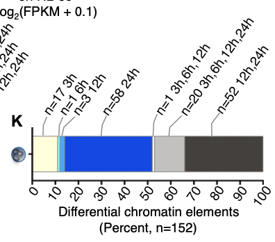

This report contains the results of analyzing a portion of the ATAC-Seq data generated in Ramirez et al, 2017 (https://www.sciencedirect.com/science/article/pii/S240547121730090X). Our group was in charge to analyze the data from the neutrophil cell line at early differentiation stages (3h, 6h and 12h).

```{r setup, include=FALSE}
#knitr::opts_chunk$set(echo = TRUE)
knitr::opts_chunk$set(warning = FALSE, message = FALSE)
```
# Task 1. Downloading the ATAQ-Seq data from GEO Repository

We perfomed a manually download of the ATACSeq and RNASeq data of 12 samples for the time points: 0h, 3h, 6h and 12h (each sample in triplicates) from the GEO web (https://www.ncbi.nlm.nih.gov/geo/) using the ids provided in the manuscript (for ATACSeq GSE79046, for RNASeq GSE79044). For each sample of interest we got the bed file, bw file and the processed counts.

# Task 2. Identifying the differential acccesible peaks across the three time points

The peaks calling produce a bed file that contains the peaks locations together with peak summit, fold-change, pvalues and qvalues. We use this files as the input for our analysis. 
```{r message=FALSE}
# Script for finding consensus peaks
rm(list = ls())
library(rtracklayer)
library(GenomicRanges)
library(knitr)

#setwd

# control panel
raw_data_folder <- './ATACseq/beds/'
min_overlap <- 0.3
chromosomes <- paste0('chr', c(1:22, 'X', 'Y'))

# bed files 
bed_files <- file.path(raw_data_folder, 
                       dir(raw_data_folder, pattern = '*.bed'))
bed_files <- bed_files[1:12]
bed_files
```
We create an R function to create the file of consensus peaks
```{r}
# function for finding intersecting peaks
find_intersection <- function(reference_bed, subject_bed, chromosomes){
  
  # subsetting 
  reference_bed <- reference_bed[seqnames(reference_bed) %in% chromosomes]
  seqlevels(reference_bed) <- chromosomes
  subject_bed <- subject_bed[seqnames(subject_bed) %in% chromosomes]
  seqlevels(subject_bed) <- chromosomes
  
  # finding overlap between the two files
  hits <- findOverlaps(reference_bed, subject_bed)
  overlaps <- pintersect(reference_bed[queryHits(hits)], 
                         subject_bed[subjectHits(hits)])
  
  # overlap fraction with respect to the original peaks
  percent_overlap_on_1 <- width(overlaps) / width(reference_bed[queryHits(hits)])
  percent_overlap_on_2 <- width(overlaps) / width(subject_bed[subjectHits(hits)])
  hits <- hits[percent_overlap_on_1 > min_overlap & 
                 percent_overlap_on_2 > min_overlap]
  
  # subsetting the bed files
  reference_bed <- reference_bed[queryHits(hits)]
  subject_bed <- subject_bed[subjectHits(hits)]
  
  # "reducing" the peaks
  reduced_start <- pmin(start(reference_bed), 
                        start(subject_bed))
  reduced_end <- pmax(end(reference_bed), 
                      end(subject_bed))
  start(reference_bed) <- reduced_start
  end(reference_bed) <- reduced_end
  
  return(reference_bed)
  
}

```

```{r}

# overlapping peaks in HL60-0h ref.
hl60_bed_files <- bed_files[1:3] 
hl60_reference_bed <- import(hl60_bed_files[1])
for(i in 2:length(hl60_bed_files)){
  
  # loading the bed file
  subject_bed <- import(hl60_bed_files[i])
  
  # intersecting
  hl60_reference_bed <- find_intersection(hl60_reference_bed, subject_bed, chromosomes)
  
}

# overlapping peaks in Neu-3h
Neu3h_bed_files <- bed_files[4:6] 
Neu3h_reference_bed <- import(Neu3h_bed_files[1])
for(i in 2:length(Neu3h_bed_files)){
  
  # loading the bed file
  subject_bed <- import(Neu3h_bed_files[i])
  
  # intersecting
  Neu3h_reference_bed <- find_intersection(Neu3h_reference_bed, subject_bed, chromosomes)
  
}

# overlapping peaks in Neu-6h
Neu6h_bed_files <- bed_files[7:9] 
Neu6h_reference_bed <- import(Neu6h_bed_files[1])
for(i in 2:length(Neu6h_bed_files)){
  
  # loading the bed file
  subject_bed <- import(Neu6h_bed_files[i])
  
  # intersecting
  Neu6h_reference_bed <- find_intersection(Neu6h_reference_bed, subject_bed, chromosomes)
  
}

# overlapping peaks in Neu-12h
Neu12h_bed_files <- bed_files[10:12] 
Neu12h_reference_bed <- import(Neu12h_bed_files[1])
for(i in 2:length(Neu12h_bed_files)){
  
  # loading the bed file
  subject_bed <- import(Neu12h_bed_files[i])
  
  # intersecting
  Neu12h_reference_bed <- find_intersection(Neu12h_reference_bed, subject_bed, chromosomes)
  
}
# how many peaks?
length(hl60_reference_bed)
length(Neu3h_reference_bed)
length(Neu6h_reference_bed)
length(Neu12h_reference_bed)

```

```{r}
# peak union!
union_reference_bed <- c(hl60_reference_bed,Neu3h_reference_bed,Neu6h_reference_bed,Neu12h_reference_bed)
length(union_reference_bed)

# reducing: concatenating intervals that are overlapping
union_reference_bed <- reduce(union_reference_bed)
length(union_reference_bed)

# loading black listed regions
# https://www.encodeproject.org/annotations/ENCSR636HFF/
black_listed_bed <- import('ENCFF356LFX.bed')

# any hit?
hits <- findOverlaps(union_reference_bed, black_listed_bed)
hits

# what about the length of the overlap?
overlaps <- pintersect(union_reference_bed[queryHits(hits)], 
                       black_listed_bed[subjectHits(hits)])
summary(width(overlaps)/width(union_reference_bed[queryHits(hits)]))

# eliminating the blacklisted regions
union_reference_bed <- union_reference_bed[-queryHits(hits)]

# writing the reference
export.bed(union_reference_bed, con = 'refererence.bed')
```

## From bw to count

For differential chromatin accesibility analyses, the information in BAM files can be significantly compressed by storing just the coverage information. That is, the number of reads overlapping each base of the genome. BigWig files can efficiently store the coverage information. Inside R, the rtracklayer (Lawrence, Gentleman, and Carey, 2009) allows users to read data from BigWig files, and with some code, we can construct the count matrix.

```{r}

# Script for coverting bigWig + bed files to counts
# Partially adapted from https://lcolladotor.github.io/protocols/bigwig_DEanalysis/

# set up
rm(list = ls())
library(rtracklayer)
library(GenomicRanges)

# control panel
raw_data_folder <- './ATACseq/bws/'
#according to paper methods average read length is 80 (ale had 36)
read_length <- 80
chromosomes <- paste0('chr', c(1:22, 'X', 'Y'))
reference_file <- './refererence.bed'

# bw files
bw_files <- file.path(raw_data_folder, dir(raw_data_folder, pattern = '*.bw'))
bw_files <- bw_files[1:12]

# loading reference bed
peaks <- import(reference_file)

# count matrix
count_matrix <- matrix(0, length(peaks), length(bw_files))
rownames(count_matrix) <- paste0(seqnames(peaks), '_', start(peaks), '_', end(peaks))
colnames(count_matrix) <- letters[1:length(bw_files)]

# looping over files
for(i in 1:length(bw_files)){
  
  # current files
  print(paste0('sample ', i, ' out of ', length(bw_files)))
  bw_file <- bw_files[i]
  
  # sample name
  sample_name <- gsub(raw_data_folder, '', bw_file, fixed = TRUE)
  sample_name <- gsub('.bw', '', sample_name, fixed = TRUE)
  sample_name <- gsub('/', '', sample_name, fixed = TRUE)
  sample_name <- strsplit(sample_name, '_')[[1]][2]
  sample_name <- paste0('T', sample_name) 
  
  # loadind and downsizing the bigwigfile
  bw_file_list <- BigWigFileList(bw_file)
  coverage <- import(bw_file_list[[1]], as = 'RleList')
  # head(coverage)
  coverage <- coverage[names(coverage) %in% chromosomes]
  
  # split the peaks across chromosomes
  peaks_list <- split(peaks, seqnames(peaks))
  #to_keep <- which(sapply(peaks_list, length) > 0)
  #peaks_list <- peaks_list[to_keep]
  
  # ensuring peaks list and coverage have the same chromosomes
  common_chromosomes <- intersect(names(coverage), 
                                   as.character(unique(seqnames(peaks_list))))
   peaks_list <- peaks_list[names(peaks_list) %in% common_chromosomes]
   coverage <- coverage[names(coverage) %in% common_chromosomes]
  
  # coverage per peak
  coverage <- coverage[names(peaks_list)]
  peaks_coverage <- Views(coverage, ranges(peaks_list))
  # peaks_coverage$chr1
  # peaks_coverage$chr1[[1]]
  
  # count values
  counts <- sapply(peaks_coverage, sum)
  # head(counts$chr1) 
  # sum(sapply(counts, length))
  # length(peaks)
  
  # ensuring to have the right peak information
  chrs <- rep(names(peaks_coverage), sapply(peaks_coverage, length))
  starts <- sapply(peaks_coverage, start)
  ends <- sapply(peaks_coverage, end)

  # converting to vector
  counts <- unlist(counts)
  names(counts) <- paste0(chrs, '_', unlist(starts), '_', unlist(ends))
  # head(counts)
  
  # rounding up
  counts <- round(counts / read_length)
  # head(counts)
  
  # fractions of reads in peaks
  sum(counts)
  all_counts <- sapply(coverage, sum)
  all_counts <- sum(all_counts)
  all_counts <- round(all_counts / read_length)
  all_counts
  sum(counts) / all_counts
  
  # count as data frame
  count_matrix[names(counts), i] <- counts
  colnames(count_matrix)[i] <- sample_name
  # head(count_matrix)
  
}

# writing
count_matrix <- as.data.frame(count_matrix)
count_matrix <- cbind(peak = rownames(count_matrix), count_matrix)
head(count_matrix)
write.csv(count_matrix, row.names = FALSE,
          file = 'count_matrix_v2.csv')
```

## Differential analysis

With this analysis we compare the chromatin accesibility status between different experimental conditions, in our experiment time points. In this case we used DESeq2 on reads assigned to peaks to get differentially open peaks between the different time points (3h, 6h, 12h) against the starting time point (0h). However this comparison is also posible using bed tools.
In an experiment without replicates, you can use bedtools to compare two samples using the function intersectBed (finds the subset of peaks common in 2 samples or unique to one them). If you have replicates, you can use: 1) bedtools merge function to merge the peaks or  2) bedtools coverage function to count the number of reads in peaks. 

```{r}
library(DESeq2)
library(ggplot2)
library(ChIPseeker)
library(rtracklayer)
library(clusterProfiler)
library(chipenrich)
library(TxDb.Hsapiens.UCSC.hg38.knownGene)
txdb <- TxDb.Hsapiens.UCSC.hg38.knownGene

# control panel
#I remove the LFC treshold since in the paper they dont filter by LFC.
#lfc_threshold <- 1 
sign_threshold <- 0.05

# load count matrix
count_matrix <- read.csv('./count_matrix_v2.csv')
rownames(count_matrix) <- count_matrix$peak
count_matrix$peak <- NULL
head(count_matrix)

# pheno information
pheno <- data.frame(
  cell_type = factor(c(rep('HL60', 3), rep('Neu3h', 3), rep('Neu6h', 3), rep('Neu12h', 3)))
)
#pheno$cell_type <- relevel(pheno$cell_type, ref = 'Neu3h')

# Deseq object
dds <- DESeqDataSetFromMatrix(countData = count_matrix,
                              colData = pheno,
                              design = ~ cell_type)

# PCA
log_count_matrix <- rlog(dds)
p <- plotPCA(log_count_matrix, intgroup = 'cell_type')
p <- p + 
  scale_color_discrete(name = 'Cell type') + 
  theme_bw()
plot(p)
```
from the PCA we can observe that we have two outlier samples (right bottom corner) whose variability in comparison to all the other samples is very high. In a real life context we should revise those samples carefully to identify the source of high varaibility and to consider weather or not remove it from downstream analysis. However, we will keep it since we are doing a learning exercise.
So we continue with the differential accesibility analysis 
```{r}
# differential accessibility
dds <- DESeq(dds)
#res <- as.data.frame(results(dds))
#head(res)
#set alpha parameter to keep same FDR treshold as in the paper (FDR 1%)
res_Neu3h_vs_hl60 <- results(dds, contrast = c("cell_type", "Neu3h", "HL60"), alpha = 0.01)
res_Neu6h_vs_hl60 <- results(dds, contrast = c("cell_type", "Neu6h", "HL60"), alpha = 0.01)
res_Neu12h_vs_hl60 <- results(dds, contrast = c("cell_type", "Neu12h", "HL60"), alpha = 0.01)

```
Then we can see the number of significant differential accessible peaks in the different contrast by using the function summary: 
```{r}
#Better visualization with summary instead of head 
summary(res_Neu3h_vs_hl60)
summary(res_Neu6h_vs_hl60)
summary(res_Neu12h_vs_hl60)
```

The results above shows that we identify differential accessible peaks exclusively in two contrasts: between neutrophil at 3 hours of differentiation and the starting timepoint Oh (n=70), and between neutrophil at 12 hours of differentiation and the starting timepoint Oh (n=3) for the comparisons in the 6h time point we did not identify any differential accessible peaks. This results did not surprise us, since in the original publication the authors stated that substantial changes in chromatin opening occurs later in differentiation (mostly in the interval between 48-120h). In particular, neutrophil shows genome-wide silimarities of chromatin accessibility for closely timed-samples (3,6 and 12 hours).In fact, in an interval of 0h to 24h only 152 differential events where identified in the neuthrofil. **Supplementary Figure 1.K**, describes the chromatin accesibility dynamics across several time-points in neutrophil, and we can observe that for our three time points of interest, 3h, 6h and 12h only 17, 1 and 3 differential chromatin elements were identified respectively.

```{r}

```
Now the open question is why we identify substantially more differential accessible peaks in our comparison of neutrophil at 3h vs hl60 at 0h (n=70) than those reported in the original publication (n=17) at the same time window. We hypothesized it is due to an technical bias of the tool used for the differential analysis. We used DESeq2, a tool establish for differential expression analysis based on a negative-binomial model and considered as gold standards in the RNASeq differential analysis field. However, the DeSEq2 algorithm does not consider time course analysis on its traditional comparison, then, it allows a naive investigations of time course data (Spies et al, 2019). In contrast, the authors in the original manuscript used MaSig2Pro which is a method specifically developed to identify significantly differential expression profiles in time-course experiments (Conesa et al,2006) MaSigPro models data in a two regresion step (Conesa et al,2006) the data is first modeled with a negative binomial distribution to subsequently perform polynomial regression and a log likelihood ratio test to fit genes and detect differential expression paterns(Spies et al, 2019). Therefore, the MaSigPro method used for the original authors account for the temporal correlation between time points and reduces the identification of false positives.While in our approach with DESeq2 we performed pairwise comparison of time point series, thereby neglecting temporal dependencies and information that could increase predictive power and introducing false positives, which are the reason why we are reporting more differential accessible peaks on the 3h group.

# Task 3. Grouping the differential accesible peaks by trends across the three time points
The aim of this task was to identify weather there were any consistent pattern of increase or decrease of chromatin accessibility along the three different developmental time points of interest in  neutrophil (3h, 6h,12h). However since we fail to identify any significant differential accessible peaks at 6h we performed the comparison only between 3h and 12h time points. 

```{r}
#Visualizing the differential accessible peaks
de_peaks_3h <- as.data.frame(res_Neu3h_vs_hl60)[which(res_Neu3h_vs_hl60$padj < 0.01),]
de_peaks_12h <- as.data.frame(res_Neu12h_vs_hl60[which(res_Neu12h_vs_hl60$padj < 0.01),])
#lets check if the 3 peaks on the 12h are also present in the 3h 
sum(rownames(de_peaks_12h) %in% rownames(de_peaks_3h)) #3 yes!
#Extracting the 3 peaks from 3h that are also present at 12h
de_peaks_match <- subset(de_peaks_3h, rownames(de_peaks_3h) %in% rownames(de_peaks_12h))

#data preparation for plot
dat <- data.frame(Peak = c("chr4_49149516_49150023","chr4_49149516_49150023", "chr8_3812529_3813156", 
                            "chr8_3812529_3813156", "chr16_46388213_46388390", "chr16_46388213_46388390"),
                  Time = c("3h", "12h", "3h", "12h", "3h", "12h"),
                  log2fc = c(de_peaks_match[1,2],de_peaks_12h[1,2],de_peaks_match[2,2],de_peaks_12h[2,2],
                             de_peaks_match[3,2],de_peaks_12h[3,2]))
#Making time a factor to avoid reorder
dat$Time <- factor(dat$Time)
#plotting bars
ggplot(dat, aes(Peak, log2fc)) +
  geom_bar(aes(fill = Time), stat="identity", position="dodge", width=.5) +
  scale_fill_manual(values = c("grey80", "grey20"))

```

From the figure above we can observe that in neutrophil the direction of the differential accessibility is maintained over the time and in most of the cases is exacerbated in the later time point (12h) in contrast to the early time point (3h). In other words, we can observe that 2 out of the 3 differential accessible regions detected in common in the contrasts (3h vs 0h) and (12h vs Oh)  have a positive log2FC in both contrast meaning that the chromatin is more accessible in the differentiated cells than in the Oh controls. Following a similar behaviour 1 out of the 3 differential accessible regions detected in common in the contrasts (3h vs 0h) and (12h vs 0h)  have a negative log2FC in both contrast meaning that the chromatin is less accessible in the differentiated cells than in the Oh controls. However in terms of magnitude there are some differences for example the peak chr16_46388213_46388390 has a slighly higher Log2fc value in the contrast (12h vs 0h) than in the contrast (3h vs 0h) meaning that in that specific region of the genome the chromatin is more accessible over the time. In contrast, for the peak chr4_49149516_49150023 the LogFC slighly decreased in the (12h vs 0h) contrast, meaning that over the time the chromatin in that specific region is less accessible than in early times, but, it is still in a open configuration; contrary to what is observed in the peak chr8_3812529_3813156 which has a negative LogFC in both contrasts, reflecting a close and unaccesible chromatine on the specific genome location, however the chromatin is much more compact after 12h of differentiation than after 3h.meanining that over the time that region is less suceptible to be transcribed. 

# Task 4. Correlation of gene expression and ATAC-Seq Trends

Finally, we are linking peaks to nearby genes by identifying all the genes in a certain distance (3kb in this case). Once we identify the genes linked to the peaks, we are going to try to identify if there is any correlation between the enrichment of peaks in a determine gene and its expression.

```{r}
#First step is to annotate the peaks in common in our time points to identify in which genes they match
# annotating
# loading the reference bed file
peaks <- import('./refererence.bed')
# creating the peak name
peaks$name <- paste0(seqnames(peaks), '_', start(peaks), '_', end(peaks))
target_peaks <- peaks[peaks$name %in% rownames(de_peaks_match)]

peakAnno <- annotatePeak(target_peaks, tssRegion=c(-3000, 3000),
                         TxDb=txdb, annoDb="org.Hs.eg.db")
peakAnno
# plotting
plotAnnoBar(peakAnno)
plotDistToTSS(peakAnno)

# which are the significant genes?
#sign_genes <- seq2gene(target_peaks, tssRegion = c(-1000, 1000), 
                      # flankDistance = 3000, TxDb = txdb)

#sign_genes
#Error in exons$gene : $ operator is invalid for atomic vectors
```
Since We failed to retrieve the gene annotation corresponding to our peaks of interest by using the function seq2gene we decide to retrieve their annotation manually from Ensembl web server. Our three peaks of interest are distributed as:

| Peak                    | Annotation               | Feature            |
|-------------------------|--------------------------|--------------------|
| chr4_49149516_49150023  | Pericentromeric region   | Distal Intergenic  |
| chr8_3812529_3813156    | CSMD1                    | Other Intron       |
| chr16_46388213_46388390 | Upstream ENSG00000290429 | Distal Intergenic  |

From our annotation we can conclude that the peak chr4_49149516_49150023 is a false positive, since in many species the pericentromeric regions of chromosomes are enriched in transposable elements and simple sequence repeats because this region is depeted of genes and has a low recombination rates. What we are observing is this specific case are reads mapping to repetitive sequences in the peri-centromeric region. This enrichment should be controlled during the mapping step in the preprocessing, some mapping tools like BWA controls for this kind of errors by default. However,in the original paper the authors reported they used Bowtie for mapping the reads against the human reference genome therefore, which is a tool that does not control it by default, then the authorsshould have added a parameter in the running options to remove the noisy annotations from the pericentromere region.In the paper they don't specify weather they consider or not this on the mapping.
For the other two peaks chr8_3812529_3813156 is located in an intron of CSMD1 gene and chr16_46388213_46388390 is located in an intergenic region where the closest gene is the novel transcript ENSG00000290429 still uncategorized and with an unknown fuction. Therefore, predict the effect on gene expression patterns of these peaks is difficult and highly dependent on the genome architecture. Nevertheless, recent publications have shown that non coding intergenic regions and introns could regulate the expression of neighboring genes in a tissue specific manner (Jaura et al, 2022). Even some researchers have proposed that intergenic and genic sequence lengths have opposite relationships with respect to expression, apparently longer intergenic regions can have higher impact in gene expression (Colinas et al, 2008). Therefore to understand the role of accessible chromatin of non coding DNA on gene expression is necessary to perform complementary analysis to consider the 3D organization of the DNA and its regulatory elements.

# References 

1. Ramirez, R. N., El-Ali, N. C., Mager, M. A., Wyman, D., Conesa, A., & Mortazavi, A. (2017). Dynamic gene regulatory networks of human myeloid differentiation. Cell systems, 4(4), 416-429.

2. Yan, F., Powell, D.R., Curtis, D.J. et al. From reads to insight: a hitchhiker’s guide to ATAC-seq data analysis. Genome Biol 21, 22 (2020). https://doi.org/10.1186/s13059-020-1929-3

3. Spies D, Renz PF, Beyer TA, Ciaudo C. Comparative analysis of differential gene expression tools for RNA sequencing time course data. Brief Bioinform. 2019 Jan 18;20(1):288-298. doi: 10.1093/bib/bbx115. PMID: 29028903; PMCID: PMC6357553.

4. Ana Conesa, María José Nueda, Alberto Ferrer, Manuel Talón, maSigPro: a method to identify significantly differential expression profiles in time-course microarray experiments, Bioinformatics, Volume 22, Issue 9, May 2006, Pages 1096–1102, https://doi.org/10.1093/bioinformatics/btl056

5. Jaura, R., Yeh, SY., Montanera, K.N. et al. Extended intergenic DNA contributes to neuron-specific expression of neighboring genes in the mammalian nervous system. Nat Commun 13, 2733 (2022). https://doi.org/10.1038/s41467-022-30192-z

6. Colinas, J., Schmidler, S. C., Bohrer, G., Iordanov, B., & Benfey, P. N. (2008). Intergenic and genic sequence lengths have opposite relationships with respect to gene expression. PLoS One, 3(11), e3670.

7. Lawrence M, Gentleman R, Carey V (2009). “rtracklayer: an R package for interfacing with genome browsers.” Bioinformatics, 25, 1841-1842. doi:10.1093/bioinformatics/btp328, http://bioinformatics.oxfordjournals.org/content/25/14/1841.abstract.


